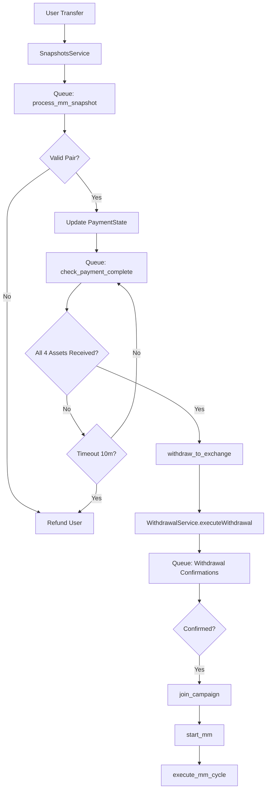

# Market Making Order Framework

## 1. Overview

The market making order processing system has been redesigned to move from a volatile **EventEmitter** pattern to a robust, state-driven **Bull Queue state machine**. This ensures reliability, persistence across restarts, and a clear audit trail for every user order.

### Key Architectural Benefits

- **Persistence**: Job states are stored in Redis.
- **Reliability**: Built-in retry mechanisms with exponential backoff.
- **Idempotency**: Using `jobId` (based on snapshot IDs) prevents duplicate processing.
- **Observability**: Clear tracking of jobs through different lifecycle stages.

---

## 2. State Machine Lifecycle

We use a granular set of 17 states to track the order's progress from the first deposit to the final execution.

```typescript
export type MarketMakingStates =
  // Payment States
  | 'payment_pending'       // Waiting for first payment
  | 'payment_incomplete'    // Partial payment received (waiting for more assets/fees)
  | 'payment_complete'      // All required assets (base+quote+fees) received
  // Withdrawal States  
  | 'withdrawing'           // Withdrawal to exchange initiated
  | 'withdrawal_confirmed'  // Withdrawal confirmed on Mixin
  | 'deposit_confirming'    // Waiting for exchange deposit confirmation
  | 'deposit_confirmed'     // Exchange deposit confirmed
  // Campaign States
  | 'joining_campaign'      // Joining HUFI campaign
  | 'campaign_joined'       // Successfully joined campaign
  // Execution States
  | 'created'               // Ready to start strategies
  | 'running'               // Market making strategy is active
  | 'paused'                // Paused by user
  | 'stopped'               // Stopped by user
  // Terminal States
  | 'failed'                // Process failed
  | 'refunded'              // Funds returned to user
  | 'deleted';              // Soft deleted
```

---

## 3. The 4-Transfer System

A complete market-making order initialization can involve up to **4 distinct transfers** from the user.

### Transfer Breakdown

| #   | Asset Type      | Purpose                                                    |
| --- | --------------- | ---------------------------------------------------------- |
| 1   | **Base Asset**  | The primary trading asset (e.g., BTC)                      |
| 2   | **Quote Asset** | The secondary trading asset (e.g., USDT)                   |
| 3   | **Base Fee**    | Withdrawal fee for sending the base asset to the exchange  |
| 4   | **Quote Fee**   | Withdrawal fee for sending the quote asset to the exchange |

**Note**: Fees might be in the same asset (e.g., "WBTC Fee" paid in "WBTC") or in a chain asset (e.g., "WBTC Fee" paid in "ETH"). The system tracks these based on the `FeeService` configuration.

### Payment State Entity

The `PaymentState` record tracks the accumulation of these 4 assets:

- `baseAssetAmount` & `baseAssetSnapshotId`
- `quoteAssetAmount` & `quoteAssetSnapshotId`
- `baseFeeAssetAmount` & `baseFeeAssetSnapshotId`
- `quoteFeeAssetAmount` & `quoteFeeAssetSnapshotId`
- `requiredBaseWithdrawalFee` & `requiredQuoteWithdrawalFee` (calculated targets)

---

## 4. Processing Pipeline

### Job Handlers (Bull Queue: `market-making`)

| Handler                  | Description                                                         | Trigger                          |
| ------------------------ | ------------------------------------------------------------------- | -------------------------------- |
| `process_mm_snapshot`    | Validates trading pair, calculates fees, updates `PaymentState`     | Mixin Snapshot detected          |
| `check_payment_complete` | Polling loop (every 10s) checking if all 4 assets meet requirements | `process_mm_snapshot` success    |
| `withdraw_to_exchange`   | Triggers the `WithdrawalService` for both base and quote            | All payments confirmed           |
| `join_campaign`          | Registers the user for HUFI rewards                                 | Withdrawal confirmed on exchange |
| `start_mm`               | Transitions to active strategy execution                            | Campaign joined                  |
| `execute_mm_cycle`       | One loop of placing/canceling orders                                | Active `running` state           |

### Detailed Workflow Diagram



---

## 5. Success & Error Scenarios

### Success Scenario

1. T=0: User sends BTC, USDT + Fees invoice payments
2. T=10s: System detects BTC payment, system creates `PaymentState`.
3. T=40s: `check_payment_complete` detects full payment.
4. T=60s: System withdraws to Binance.
5. T=10m: Binance confirms deposit. System joins campaign.
6. T=11m: Strategy starts running.

### Failure Scenarios

- **Unknown Asset**: If an asset not related to the pair is sent, it is refunded immediately.
- **Timeout**: If all 4 assets aren't received within 10 minutes, the partial funds are refunded.
- **Insufficient Fees**: If the fee assets sent are less than `requiredBaseWithdrawalFee` or `requiredQuoteWithdrawalFee`, the process stays in `payment_incomplete` until timeout or more is sent.

---

## 6. Implementation Status (Done ✅)

### Core Refinement

- ✅ **Bull Queue Migration**: Moved from `EventEmitter` logic to `market-making` queue.
- ✅ **New Processor**: Created `MarketMakingOrderProcessor` with full async job support.
- ✅ **4-Transfer Tracking**: Refactored `PaymentState` to handle 4 asset buckets.
- ✅ **Service Decoupling**: Moved `withdrawal` logic from `SnapshotsService` to `WithdrawalService.executeWithdrawal()`.
- ✅ **Fee Integration**: Integrated `FeeService` for real-time target fee calculation.
- ✅ **Campaign Integration**: Automated `MmCampaignService` calls during the pipeline.

---

## 7. Configuration & Monitoring

### Environment Variables

- `RUN_MIXIN_SNAPSHOTS=true`: Enables snapshot polling.
- `RUN_MIXIN_WITHDRAWAL_CONFIRMATION=true`: Enables the confirmation worker.
- `STRATEGY_RUN=true`: Enables general strategy execution.

### Monitoring

- **Bull Board**: Monitor the `market-making` and `withdrawals` queues.
- **Logs**: Filter by context `[MarketMakingOrderProcessor]`.

---

## 8. Remaining TODOs

1. **Dynamic Exchange Addresses**: Currently placeholders like `TODO_BASE_DEPOSIT_ADDRESS` exist. Need to integrate with exchange API/config to fetch unique user deposit addresses.
2. **Full Refund Logic**: Timeout logic currently refunds the triggering snapshot. It should clear the entire `PaymentState` and refund all 4 asset buckets.
3. **Memo Strategy Params**: Extract `bidSpread`, `askSpread`, etc., from the memo instead of using defaults.
4. **Database Migration**: Generate the TypeORM migration for the updated `PaymentState` columns.

---

**Created**: 2026-01-01  
**Version**: 2.1.0  
**Compiler Status**: ✅ Success (yarn build)
