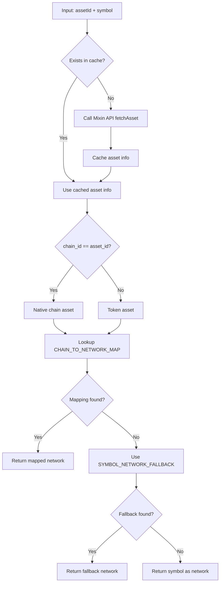

# Network Mapping Service - Complete Implementation Guide

## Overview

`NetworkMappingService` is an intelligent service that maps Mixin Network Asset IDs to network identifiers required by the CCXT exchange library. This solves the identification problem for multi-chain assets (like USDT) across different blockchain networks.

## Background

### Mixin Network Asset Structure

Each asset in Mixin Network has:

- **asset_id**: Unique identifier in UUID format
- **chain_id**: The blockchain ID where this asset resides
- **symbol**: Asset symbol (e.g., BTC, USDT, ETH)

### CCXT Network Parameters

CCXT requires specifying a network when calling `fetchDepositAddress(symbol, { network })`:

- For USDT: Could be `'ERC20'`, `'TRC20'`, `'BSC'`, `'MATIC'`, etc.
- For native coins: BTC uses `'BTC'`, ETH uses `'ETH'`

### Challenge

The same symbol (like USDT) can exist on multiple networks:

- USDT on Ethereum → `'ERC20'`
- USDT on Tron → `'TRC20'`
- USDT on BSC → `'BEP20'`
- USDT on Polygon → `'MATIC'`

The symbol alone cannot determine the correct network; it must be combined with Mixin's `chain_id` information.

## Implementation Logic

### 1. Three-Layer Mapping Strategy

```typescript
// Layer 1: Chain ID → Network mapping (most accurate)
CHAIN_TO_NETWORK_MAP[chainId][symbol] → network

// Layer 2: Symbol fallback mapping (common assets)
SYMBOL_NETWORK_FALLBACK[symbol] → network

// Layer 3: Use symbol itself as network (last resort)
symbol → network
```

### 2. Workflow



### 3. Core Code Logic

```typescript
async getNetworkForAsset(assetId: string, symbol: string): Promise<string> {
  // 1. Get asset info (with cache)
  const assetInfo = await this.fetchAssetWithCache(assetId);
  const chainId = assetInfo.chain_id;

  // 2. Lookup chain mapping
  const chainMapping = this.CHAIN_TO_NETWORK_MAP[chainId];
  if (chainMapping) {
    return chainMapping[symbol] || chainMapping.default;
  }

  // 3. Fallback to symbol mapping
  const fallback = this.SYMBOL_NETWORK_FALLBACK[symbol];
  if (fallback) {
    return fallback;
  }

  // 4. Finally use symbol itself
  return symbol;
}
```

## Supported Network Mappings

### Major Blockchains

| Chain ID       | Blockchain | Default Network | Supported Assets           |
| -------------- | ---------- | --------------- | -------------------------- |
| `c6d0c728-...` | Bitcoin    | `BTC`           | BTC                        |
| `43d61dcd-...` | Ethereum   | `ERC20`         | ETH, USDT, USDC, DAI, WBTC |
| `25dabac5-...` | TRON       | `TRC20`         | TRX, USDT, USDC            |
| `1949e683-...` | BSC        | `BSC`           | BNB, USDT, USDC, BUSD      |
| `b7938396-...` | Polygon    | `MATIC`         | MATIC, USDT, USDC          |
| `64692c23-...` | Solana     | `SOL`           | SOL, USDT, USDC            |
| `cbc77539-...` | Avalanche  | `AVAXC`         | AVAX, USDT, USDC           |

### Example Mappings

```typescript
// USDT on Ethereum
assetId: '4d8c508b-91c5-375b-92b0-ee702ed2dac5'
chainId: '43d61dcd-e413-450d-80b8-101d5e903357' (Ethereum)
symbol: 'USDT'
→ network: 'ERC20'

// USDT on TRON
assetId: 'b91e18ff-a9ae-3dc7-8679-e935d9a4b34b'
chainId: '25dabac5-056a-48ff-b9f9-f67395dc407c' (TRON)
symbol: 'USDT'
→ network: 'TRC20'

// BTC (native)
assetId: 'c6d0c728-2624-429b-8e0d-d9d19b6592fa'
chainId: 'c6d0c728-2624-429b-8e0d-d9d19b6592fa' (same as asset_id)
symbol: 'BTC'
→ network: 'BTC'
```

## Performance Optimization

### 1. Caching Mechanism

```typescript
private assetCache = new Map<string, any>();

// First call: API request
await getNetworkForAsset('asset-id-1', 'USDT'); // → API call

// Subsequent calls: use cache
await getNetworkForAsset('asset-id-1', 'USDT'); // → from cache
```

### 2. Parallel Processing

```typescript
// Get networks for multiple assets simultaneously
const networks = await networkMappingService.getNetworksForAssets([
  { assetId: "base-asset-id", symbol: "BTC" },
  { assetId: "quote-asset-id", symbol: "USDT" },
]);
```

## Usage Examples

### Using in MarketMakingOrderProcessor

```typescript
// Get networks for base and quote assets
const [baseNetwork, quoteNetwork] = await Promise.all([
  this.networkMappingService.getNetworkForAsset(
    paymentState.baseAssetId,
    pairConfig.base_symbol
  ),
  this.networkMappingService.getNetworkForAsset(
    paymentState.quoteAssetId,
    pairConfig.quote_symbol
  ),
]);

// Get deposit address with accurate network
const baseDepositResult = await this.exchangeService.getDepositAddress({
  exchange: "binance",
  apiKeyId: apiKey.key_id,
  symbol: "USDT",
  network: baseNetwork, // 'ERC20' or 'TRC20' etc.
});
```

## Log Output

The service outputs detailed logs to help with debugging:

```
[NetworkMappingService] Fetched asset info for USDT (4d8c508b-...): chain_id=43d61dcd-...
[NetworkMappingService] Mapped USDT on chain 43d61dcd-... to network: ERC20

[NetworkMappingService] Asset BTC is native chain, using network: BTC

[NetworkMappingService] Using fallback network for DOGE: DOGE

[NetworkMappingService] No mapping found for XYZ (...), using symbol as network
```

## Extending New Networks

### Adding New Blockchain Support

```typescript
// Add to CHAIN_TO_NETWORK_MAP
'new-chain-id-uuid': {
  default: 'NETWORK_NAME',
  TOKEN1: 'NETWORK_NAME',
  TOKEN2: 'NETWORK_NAME',
}
```

### Adding New Symbol Fallback

```typescript
// Add to SYMBOL_NETWORK_FALLBACK
SYMBOL_NETWORK_FALLBACK: {
  // ...
  NEW_TOKEN: 'DEFAULT_NETWORK',
}
```

## Error Handling

### API Call Failure

```typescript
try {
  const network = await getNetworkForAsset(assetId, symbol);
} catch (error) {
  // Automatically fallback to SYMBOL_NETWORK_FALLBACK
  // If not found, use symbol itself
}
```

### Unknown Asset

```typescript
// Will log warning and use symbol as network
[NetworkMappingService] WARN: No mapping found for XYZ, using symbol as network
```

## Testing Recommendations

### Unit Tests

```typescript
describe("NetworkMappingService", () => {
  it("should map USDT on Ethereum to ERC20", async () => {
    const network = await service.getNetworkForAsset(
      "4d8c508b-91c5-375b-92b0-ee702ed2dac5",
      "USDT"
    );
    expect(network).toBe("ERC20");
  });

  it("should map USDT on TRON to TRC20", async () => {
    const network = await service.getNetworkForAsset(
      "b91e18ff-a9ae-3dc7-8679-e935d9a4b34b",
      "USDT"
    );
    expect(network).toBe("TRC20");
  });

  it("should use cache for repeated calls", async () => {
    await service.getNetworkForAsset("asset-id", "BTC");
    const cachedInfo = service.getCachedAssetInfo("asset-id");
    expect(cachedInfo).toBeDefined();
  });
});
```

### Integration Tests

```typescript
it("should get correct deposit address for USDT-ERC20", async () => {
  const network = await networkMappingService.getNetworkForAsset(
    usdtEthereumAssetId,
    "USDT"
  );

  const depositAddress = await exchangeService.getDepositAddress({
    exchange: "binance",
    apiKeyId: "test-key",
    symbol: "USDT",
    network,
  });

  expect(depositAddress.address).toMatch(/^0x[a-fA-F0-9]{40}$/); // Ethereum address
});
```

## Maintenance Guide

### Regular Chain ID Mapping Updates

1. Monitor new blockchains added to Mixin Network
2. Check new network identifiers supported by CCXT
3. Update `CHAIN_TO_NETWORK_MAP`

### Monitor Logs

Watch for these logs:

- `Using fallback network` - May need to add chain mapping
- `No mapping found` - Need to add to fallback or chain mapping
- `Error getting network` - API call issues

## Mixin Chain ID → CCXT Network Quick Reference

### Common Mapping Table

| Asset            | Mixin Chain ID                         | CCXT Network | Description      |
| ---------------- | -------------------------------------- | ------------ | ---------------- |
| **BTC**          | `c6d0c728-2624-429b-8e0d-d9d19b6592fa` | `BTC`        | Bitcoin native   |
| **ETH**          | `43d61dcd-e413-450d-80b8-101d5e903357` | `ETH`        | Ethereum native  |
| **USDT-ERC20**   | `43d61dcd-e413-450d-80b8-101d5e903357` | `ERC20`      | Ethereum network |
| **USDT-TRC20**   | `25dabac5-056a-48ff-b9f9-f67395dc407c` | `TRC20`      | TRON network     |
| **USDT-BSC**     | `1949e683-6a08-49e2-b087-d6b72398588f` | `BEP20`      | BSC network      |
| **USDT-Polygon** | `b7938396-3f94-4e0a-9179-d3440718156f` | `MATIC`      | Polygon network  |
| **USDT-Solana**  | `64692c23-8971-4cf4-84a7-4dd1271dd887` | `SOL`        | Solana network   |
| **TRX**          | `25dabac5-056a-48ff-b9f9-f67395dc407c` | `TRC20`      | TRON native      |
| **BNB**          | `1949e683-6a08-49e2-b087-d6b72398588f` | `BEP20`      | BSC native       |
| **MATIC**        | `b7938396-3f94-4e0a-9179-d3440718156f` | `MATIC`      | Polygon native   |

### How to Find Asset ID

#### Method 1: Mixin Messenger

1. Deposit the asset to Mixin Messenger wallet
2. Visit https://mixin.one/snapshots
3. View transaction details to find `asset_id`

#### Method 2: Mixin API

```bash
curl https://api.mixin.one/network/assets/search/USDT
```

#### Method 3: Get from Code

```typescript
const asset = await client.network.fetchAsset(assetId);
console.log("Chain ID:", asset.chain_id);
console.log("Symbol:", asset.symbol);
```

### Steps to Add New Network

1. **Get Chain ID**

   ```typescript
   const asset = await client.network.fetchAsset(newAssetId);
   const chainId = asset.chain_id;
   ```

2. **Determine CCXT Network Name**

   - Check CCXT documentation or exchange API
   - Common formats: `ERC20`, `TRC20`, `BEP20`, `SOL`, `MATIC`

3. **Update Mapping Table**
   ```typescript
   // network-mapping.service.ts
   CHAIN_TO_NETWORK_MAP: {
     'new-chain-id': {
       default: 'NETWORK_NAME',
       SYMBOL1: 'NETWORK_NAME',
       SYMBOL2: 'NETWORK_NAME',
     }
   }
   ```

## Test Commands

```bash
# Build
bun run build

# Test specific assets
# Add logs in code to view mapping results
```

## Advantages

✅ **Accuracy**: Based on Mixin chain_id, not guessing  
✅ **Performance**: Built-in caching reduces API calls  
✅ **Extensibility**: Easy to add new network support  
✅ **Fault Tolerance**: Multi-layer fallback mechanism  
✅ **Observability**: Detailed log output  
✅ **Type Safety**: Full TypeScript support

---

**Created**: 2026-01-02  
**Version**: 1.0.0  
**Status**: ✅ Production Ready
